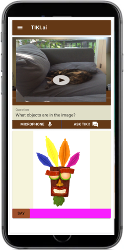
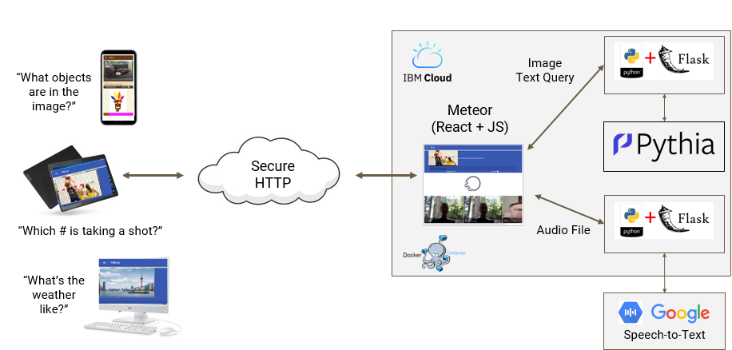
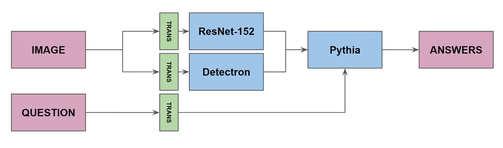
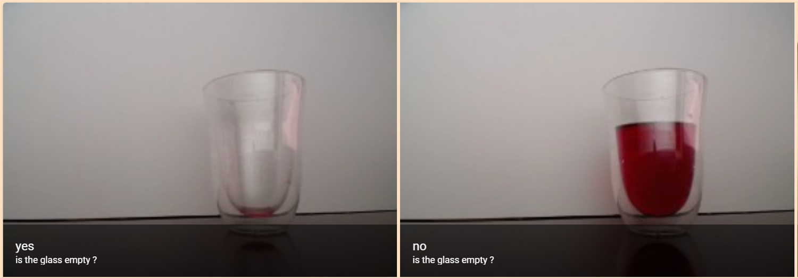
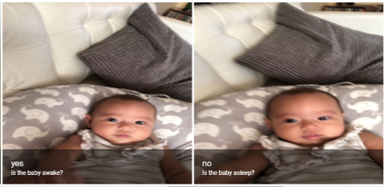
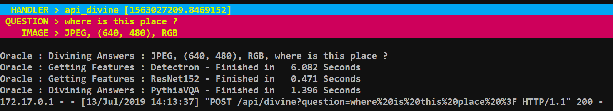

# TikiAI

Tiki was developed for MIDS W251 Final Project by Brent Biseda, Vincio De Sola, Pri Nonis, and Kevin Stone.  Tiki makes any video stream queryable via text or voice.  Users can use natural language to query the image:

 - “What objects are in the image?”  
 - “Which # is taking a shot?”  
 - “What is the weather outside?”  

Tiki works with any browser and requires no installation of software.  



## Architecture

A conceptual architecture of the webapp is shown below.  





## Examples

Is Tiki an optimist or pessimist?  



Do I need to get my baby from crib?  



## Conclusion

Visual question answering ([VQA](https://visualqa.org/)) is a new field that combines both computer vision and NLP to provide answers to simple questions using common human syntax.  This project is an implementation of a state-of-the-art VQA model (Pythia) in a web app.  Over time, this type of service will become more common throughout all smart devices such as Alexa, Siri, and others.  Tiki demonstrates the potential for this rollout to be imminent. 

## Pythia Service in Action



## Quick Start Guide

Setup on localhost with docker-compose.yml.backup.  To utilize this from a mobile device requires an https certificate.

The HTTPS certificate uses NGINX and Lets Encrypt.

```
cd w251-final/containers
docker-compose up -d
docker ps -a
```

### Test Containers Individual Services  

#### Interpreter  
```
cd w251-final/containers/interpreter/app
curl -X POST -F "audio=@sample_audio.wav" localhost:5001/api/interpret
```

#### PythiaVQA  
```
cd w251-final/containers/pythia/app
curl -X POST -F "image=@africa.jpg" localhost:5000/api/getAnswers?question='where%20is%20this%20place%20%3F'
```

#### Meteor
```
127.0.0.1:3000
```

##### NGINX Proxy

For additional information on the utilization of NGINX for proxy and HTTPS certificates, please see this link:
https://github.com/JrCs/docker-letsencrypt-nginx-proxy-companion

#### References
  - Towards VQA Models That Can Read. Singh, Amanpreet and Natarajan, Vivek and Shah, Meet and Jiang, Yu and Chen, Xinlei and Batra, Dhruv and Parikh, Devi and Rohrbach, Marcus. Proceedings of the IEEE Conference on Computer Vision and Pattern Recognition. 2019. [https://github.com/facebookresearch/pythia]

