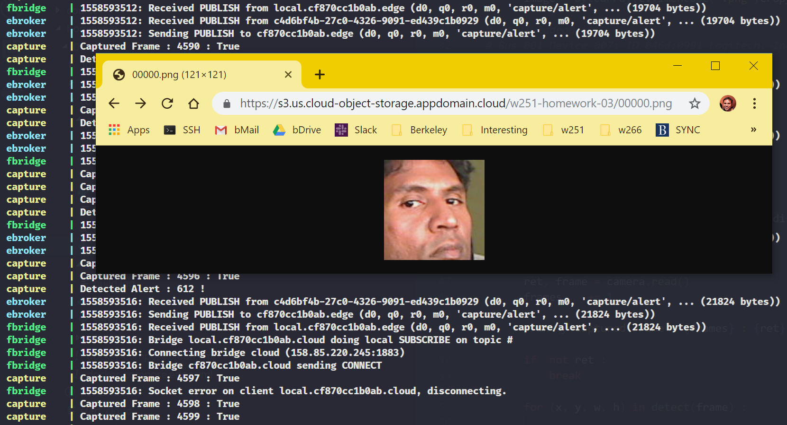

# Homework 03

The goal of this project is to in real-time (1) detect faces in a live video stream, (2) transmit face images using a message bus the cloud, (3) store face images in an object store. Five dockerized services are used to accomplish this task and can easily scale to many additional edge nodes which can create a distributed surveillance network. In the present implementation, three containers will run on a Nvidia Jetson edge device, while the remaining two service containers will run on an IBM cloud virtual machine. MQTT message bus is used to route all information in a reliable manner.

## Pre-Work
* Flash and setup Jetson AGX Xavier Device Node using Nvidia SDK Manager
* Construct Jetson AGX Xavier CUDA Enabled Dockerfile for GPU Accelerated Processing
* Provision IBM Cloud Virtual Machine and Harden for Secure Access
  + 158.85.220.245
* Provision IBM Cloud Object Storage and Generate Service Credential for Secure Access
  + https://s3.us.cloud-object-storage.appdomain.cloud/w251-homework-03/profile.jpg
* Install docker-engine and/or docker-compose on <b>Jetson AGX Device Node</b> and <b>IBM Cloud Virtual Machine</b>.

```
ibmcloud sl security sshkey-list
ibmcloud sl vs create --hostname=icloud --domain=cloud.lan --cpu=2 --memory=4096 --datacenter=sjc01 --os=UBUNTU_18_64 --san --disk=100 --key=<key_id>
```

## Edge Setup Guide

1. Connect to Jetson edge device using ssh, having previously exchanged ssh keys enabling secure passwordless connections.
2. Clone this git repository with all the required components.
3. Export DISPLAY to a host to forward X traffic.
4. Build docker container images, as defined in the respective Dockerfiles.
5. Spin up the dockerized services.

```
ssh jetson
```
<b>On Jetson IOT Device Node</b>
```
git clone git@github.com:psnonis/w251.git ~
cd ~/w251/homework/03/containers
export DISPLAY=:0
docker-compose -f docker-compose.edge.yml build
docker-compose -f docker-compose.edge.yml up
```

## Cloud Setup Guide

1. Connect to cloud virtual machine using ssh, having previously exchanged ssh keys enabling secure passwordless connections.
2. Clone this git repository with all the required components.
3. Build docker container images, as defined in the respective Dockerfiles.
4. Spin up the dockerized services.

```
ssh icloud # 158.85.220.245
```
<b>On IBM Cloud Virtual Machine</b>
```
git clone git@github.com:psnonis/w251.git ~
cd ~/w251/homework/03/containers
docker-compose -f docker-compose.cloud.yml build
docker-compose -f docker-compose.cloud.yml up
```

## Some Details

<b>Containers<b>

| Container 	| Image          	| Host   	| OS     	| Notes                       	|
|-----------	|----------------	|--------	|--------	|-----------------------------	|
| capture   	| capture:latest 	| jetson 	| ubuntu 	| Face Capture Service        	|
| ebroker   	| transit:latest 	| jetson 	| alpine 	| MQTT Broker Service (Edge)  	|
| fbridge   	| transit:latest 	| jetson 	| alpine 	| MQTT Bridge Service (Fog)   	|
| cbroker   	| transit:latest 	| icloud 	| alpine 	| MQTT Broker Service (Cloud) 	|
| storage   	| storage:latest 	| icloud 	| ubuntu 	| Face Storage Service        	|

<b>Services<b>
* Haar cascade frontal face classifier is used to detect faces and obtain bounding box coordinates.
* IBM boto3 api is used to transfer images to cloud object storage.

<b>MQTT Message Transport</b>
* Both edge and cloud brokers are setup with default pass-through configuration options.
* The fog bridge is setup to sub and pub messages across the two brokers.
* This topology can be modified to more easily support multiple edge devices.

```
connection edge
address ebroker
topic # both 2
connection cloud
address 158.85.220.245
topic # both 2
```

## Sample Face Detections on the Edge


## Sample Face Detections on the Cloud



## Code

* [containers/capture/service.py](containers/capture/service.py)
* [containers/storage/service.py](containers/storage/service.py)

## Configurations

* [containers/transit/mosquitto_bridge_fog.conf](containers/transit/mosquitto_bridge_fog.conf)

## Compositions

* [containers/docker-compose.edge.conf](containers/docker-compose.edge.conf)
* [containers/docker-compose.cloud.conf](containers/docker-compose.cloud.conf)

## Answers

* object store : https://s3.us.cloud-object-storage.appdomain.cloud/w251-homework-03/00000.png 
* mqtt topic   : capture/alert
* mqtt qos     : exactly once (2)

