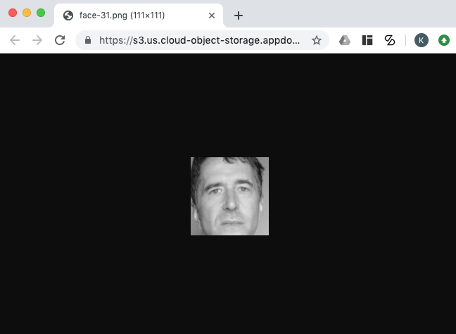
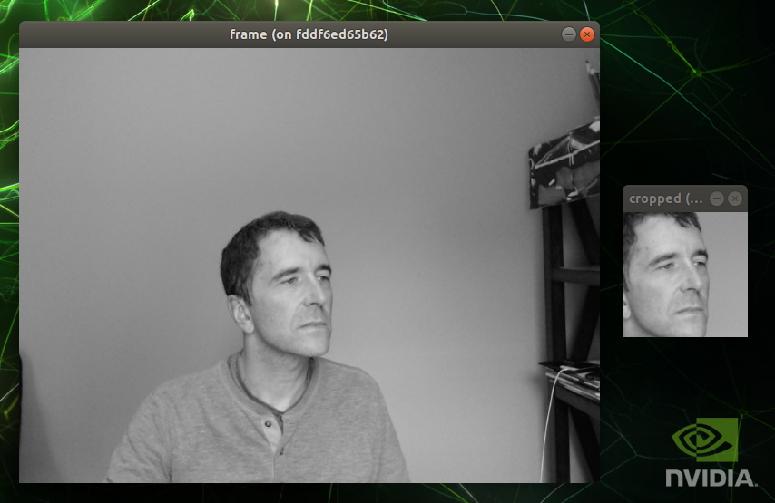

# Homework 3 - Internet of Things 101
Instructions: https://github.com/MIDS-scaling-up/v2/tree/master/week03/hw

The objective of this homework is to build a lightweight IoT application pipeline with components running both on the edge (Nvidia Jetson TX2) and the cloud (a VM in IBM Softlayer). The goal of the assignment is to be able to capture faces in a video stream coming from the edge in real time, transmit them to the cloud in real time, and save the faces in a cloud object store for long term storage.

#### Overall architecture / flow
The overall application flow / architecture is similar to 

QOS = 0 was used for sending and receiving the images.

A sample face can be accessed at https://s3.us.cloud-object-storage.appdomain.cloud/hw03-images/face-31.png which looks like



## IBM Softlayer Virtual Server Configuration

### create new virtual server in IBM cloud (HW3_server)
ibmcloud sl vs create --hostname=HW3_server --domain=you.cloud --cpu=2 --memory=2048 --datacenter=dal13 --os=UBUNTU_16_64 --san --disk=100 --key=<key_id>

use `ibmcloud sl security sshkey-list` to get <key_id>.  Create new <key_id> if necessary.

### create object storage credentials (access_key_id and secret_access_key) via cloud.ibm.com GUI
(see https://cloud.ibm.com/docs/services/cloud-object-storage?topic=cloud-object-storage-hmac)

### create cloud object store
Via cloud.ibm.com, create bucket called "hw03-images", set as public, use credentials that were just created above

### obtain ip_address of HW3_server
```
ibmcloud sl vs list
```

### ssh to HW3_server
```
ssh -l root <ip_address>
```

### install DockerCE on HW3_server
```
apt-get update
apt-get install \
    apt-transport-https \
    ca-certificates \
    curl \
    software-properties-common
```
	
### add the docker repo    
```
curl -fsSL https://download.docker.com/linux/ubuntu/gpg | sudo apt-key add -
add-apt-repository \
   "deb [arch=amd64] https://download.docker.com/linux/ubuntu \
   $(lsb_release -cs) \
   stable"
```
 
### install it
```
apt-get update
apt-get install docker-ce
```
	
###  validate that docker is installed
```
docker run hello-world
```

### harden server to prevent brute force attacks
```
vi /etc/ssh/sshd_config and make the following changes:
  PermitRootLogin prohibit-password
  PasswordAuthentication no
```

### restart the ssh daemon
```
service sshd restart
```

### install IBM Cloud Storage
```
sudo apt-get update
sudo apt-get install automake autotools-dev g++ git libcurl4-openssl-dev libfuse-dev libssl-dev libxml2-dev make pkg-config
git clone https://github.com/s3fs-fuse/s3fs-fuse.git
cd s3fs-fuse
./autogen.sh
./configure
make
sudo make install
```

### add credentials created to HW3_server
```
echo "<Access_Key_ID>:<Secret_Access_Key>" > $HOME/.cos_creds
chmod 600 $HOME/.cos_creds
```
	
### mount object-storage
(see https://cloud.ibm.com/docs/services/cloud-object-storage?topic=cloud-object-storage-s3fs)
```
mkdir /mnt/hw03-images
s3fs hw03-images /mnt/hw03-images -o passwd_file=$HOME/.cos_creds -o sigv2 -o use_path_request_style -o url=https://s3.us.cloud-object-storage.appdomain.cloud
```

### clone hw03 repo
```
git clone https://github.com/kevinmstone/W251.git
```

### create docker image
```
cd W251/HW03
docker build -t IBM_VS -f Dockerfile.IBM_VS .
```

### run containers
```
docker run --name mosquitto -p 1883:1883 -v "/root/W251/HW03":/hw03 -d ibm_vs mosquitto
docker run --name subscriber -v "/root/W251/HW03":/hw03 -v "/mnt/hw03-images":/hw03-images -d ibm_vs bash -c "python3 /hw03/subscribe_to_image.py 52.116.3.158 /hw03-images"
```

### access sample image
```
click on https://s3.us.cloud-object-storage.appdomain.cloud/hw03-images/face-0.png
```

----------

## Jetson TX2 Configuration

### Connect to Jetson TX2
```
ssh <ip_address>
```

### clone hw03 repo
```
git clone https://github.com/kevinmstone/W251.git
```

### create docker images
```
cd W251/HW03
docker build -t tx2_mosquitto -f Dockerfile.tx2_mosquitto .
docker build -t tx2_ubuntu -f Dockerfile.tx2_ubuntu .
```

### create local docker network
```
docker network create --driver bridge hw03
```

### run mosquitto broker and forwarder
```
docker run --name mosquitto --network hw03 -p 1883:1883 -v "$PWD":/HW3 -d tx2_mosquitto sh -c "mosquitto -c /HW3/mosquitto_broker_tx2.conf"
docker run --name forwarder --network hw03 -v "$PWD":/HW3 -d tx2_mosquitto sh -c "mosquitto -c /HW3/mosquitto_forwarder_tx2.conf"
```

### run xhost (must do before next step)
```
xhost + local:root
```

### run subscriber/face capture tool from TX2 terminal window with access to external display
```
docker run \
--user=root \
--env="DISPLAY" \
--volume="/etc/group:/etc/group:ro" \
--volume="/etc/passwd:/etc/passwd:ro" \
--volume="/etc/shadow:/etc/shadow:ro" \
--volume="/etc/sudoers.d:/etc/sudoers.d:ro" \
--volume="/tmp/.X11-unix:/tmp/.X11-unix:rw" \
--name face_capture --privileged --network hw03  -v "$PWD":/HW3 -ti tx2_ubuntu bash
```

***Note***: If you see `VIDEOIO ERROR: V4L2: Pixel format of incoming image is unsupported by OpenCV`, then try changing `cap = cv2.VideoCapture(0)` to `cap = cv2.VideoCapture(1)`

In face_capture container:
```
cd /HW3
python3 publish_from_video.py mosquitto
```

### Sample output of video camera and cropped face


